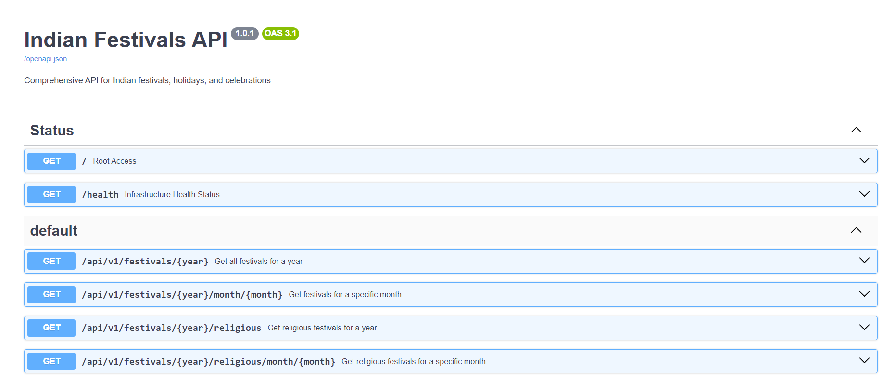

# Indian Festivals API 🎉



A production-ready, high-performance FastAPI service providing comprehensive information about Indian festivals, holidays, and celebrations. Dynamically scrapes and normalizes calendar dates using an asynchronous parser combined with a thread-safe caching layer.

---

## 🌟 Features

- **No Authentication Required** - Fully public API endpoints for ease of integration.
- **Asynchronous Scraping Engine** - Dynamic, non-blocking page parses powered by `httpx` and `BeautifulSoup4`.
- **Proxy-Aware Rate Limiting** - Protects routes via `slowapi` using proxy-safe IP extraction (supports Render, Cloudflare, etc.).
- **Thread-Safe TTL Caching** - Multi-core friendly memory cache with custom item-level expiration rules.
- **Strict Input Validation** - Bounded numerical checks and string formatting driven by `Pydantic v2`.
- **Structured Health Monitoring** - Live infrastructure health check endpoints for liveness/readiness probes.
- **Modern Package Management** - Built using the ultra-fast Python package installer and resolver `uv`.

---

## 📋 Documentation Directory

For deep technical insights and usage details, refer to the dedicated documentation files inside the `docs/` folder:

* **[API Endpoint Reference](file:///e:/codeLabPraveen/own/program/python/prj/apis/indian-festivals-api/docs/api.md)**: Details path parameters, response schemas, and curl/client invocation examples.
* **[Caching Architecture](file:///e:/codeLabPraveen/own/program/python/prj/apis/indian-festivals-api/docs/cache.md)**: Explains the internal TTLCache mechanics and custom expiration tuple wrapping.
* **[Data Models & Schemas](file:///e:/codeLabPraveen/own/program/python/prj/apis/indian-festivals-api/docs/schema.md)**: Details Pydantic validation structures and response payloads.
* **[Scraper & Color Mapping Design](file:///e:/codeLabPraveen/own/program/python/prj/apis/indian-festivals-api/docs/architecture.md)**: Illustrates the project module structure and Astrosage Panchang color-parsing mechanics.
* **[Upgrade Blueprint](file:///e:/codeLabPraveen/own/program/python/prj/apis/indian-festivals-api/docs/upgrade_blueprint.md)**: Details the migration path and design decisions made when upgrading from 1.0.0 to 1.0.1.

---

## 🚀 Quick Start

### Prerequisites
* **Python 3.14+**
* **[uv](https://github.com/astral-sh/uv)** (Python package manager)

### Local Development Setup

1. **Clone the repository**
   ```bash
   git clone https://github.com/pyapril15/indian-festivals-api.git
   cd indian-festivals-api
   ```

2. **Initialize Environment Variables**
   Create a local `.env` file by copying the template:
   ```bash
   cp .env.example .env
   ```

3. **Install Dependencies & Set Up Virtual Environment**
   Using `uv`, download and synchronize all dependencies instantly:
   ```bash
   uv sync
   ```

4. **Run the Application**
   Run the ASGI server locally under development reload modes:
   ```bash
   uv run uvicorn app.main:app --reload --host 0.0.0.0 --port 8000
   ```

5. **Verify Live Access**
   * **API Root**: [http://localhost:8000/](http://localhost:8000/)
   * **Swagger Interactive UI**: [http://localhost:8000/docs](http://localhost:8000/docs) (Only visible when `DEBUG=True` in `.env`)
   * **Health Check**: [http://localhost:8000/health](http://localhost:8000/health)

---

## 📦 Project Structure

```
indian-festivals-api/
├── app/
│   ├── api/
│   │   ├── dependencies.py     # Cache and Service lifecycle managers
│   │   └── routes.py           # Endpoint routers and parameters
│   ├── middleware/
│   │   ├── error_handler.py    # Global system exception interceptors
│   │   └── rate_limiter.py     # IP rate limit controls (slowapi)
│   ├── models/
│   │   └── schemas.py          # Pydantic v2 payload models
│   ├── services/
│   │   ├── festival_service.py # Coordinates caching and scraping
│   │   └── scraper.py          # Asynchronous BeautifulSoup parser
│   ├── utils/
│   │   └── cache.py            # Thread-safe TTLCache implementation
│   ├── config.py               # Singleton app configuration
│   └── main.py                 # FastAPI app entrypoint
├── docs/                       # Granular markdown documentation
│   ├── api.md
│   ├── cache.md
│   ├── schema.md
│   └── architecture.md
├── tests/
│   └── test_api.py             # Pytest endpoint validation suite
├── .env.example                # Template configuration variables
├── pyproject.toml              # Project dependencies and details
├── render.yaml                 # Infrastructure configuration for Render
└── uv.lock                     # Locked dependency definitions
```

---

## 🔧 Configuration

All variables are loaded securely from the `.env` file at startup:

| Variable | Type | Default | Purpose |
| :--- | :--- | :--- | :--- |
| `APP_NAME` | string | `"Indian Festivals API"` | Application signature |
| `APP_VERSION` | string | `"1.0.1"` | Release version reference |
| `DEBUG` | boolean | `False` | Disables interactive docs and mock modes if false |
| `HOST` | string | `"0.0.0.0"` | Local bind interface |
| `PORT` | integer | `8000` | Server runtime port |
| `RATE_LIMIT_REQUESTS` | integer | `100` | Maximum allowed request limit |
| `RATE_LIMIT_WINDOW` | integer | `60` | Duration window in seconds |
| `CACHE_TTL` | integer | `3600` | Eviction cooldown in seconds |
| `CORS_ORIGINS` | JSON list | `["https://praveenyadavme.vercel.app"]` | Allowed CORS origins |

---

## 🌐 Deploy to Render

The API is fully pre-configured for instant deployment on [Render](https://render.com) using the in-repo [`render.yaml`](file:///e:/codeLabPraveen/own/program/python/prj/apis/indian-festivals-api/render.yaml) configuration.

### Manual Setup on Render Web Console

1. Create a **New Web Service** and link your repository branch.
2. Select **Python** as the runtime environment.
3. Configure the environment variables:
   * Key: `PYTHON_VERSION`, Value: `3.14.0`
4. Apply the `uv` build instructions:
   * **Build Command**: `uv sync --frozen --no-dev`
   * **Start Command**: `uv run uvicorn app.main:app --host 0.0.0.0 --port $PORT`
5. Configure the Live Health Probe path to `/health` to allow Render to safely coordinate blue-green deployment lifecycle transitions.

---

## 🧪 Testing

Run the test suite locally using the following `uv` command:

```bash
# Installs pytest & runs validation checks against local environment
uv run --with pytest --with pytest-asyncio --with httpx pytest tests/ -v
```

---

## 🔄 Changelog

### Version 1.0.1 (2026-06-12)
- Upgraded package execution layers to use `uv` and Python `3.14`.
- Extracted documentation into a dedicated `docs/` folder.
- Replaced legacy text reference files with detailed markdown files (`api.md`, `cache.md`, `schema.md`, `architecture.md`).
- Added a `.env.example` file.
- Fixed a rate-limiting duration string format error causing requests to crash under middleware processing.
- Resolved a custom TTL caching bug where tuples returned were not properly unwrapped during cache hits.

### Version 1.0.0 (2025-10-22)
- Initial release.
- Integrated BeautifulSoup scraping from Astrosage.
- Implemented rate-limiting and memory cache policies.

---

## 📄 License

This project is licensed under the MIT License.