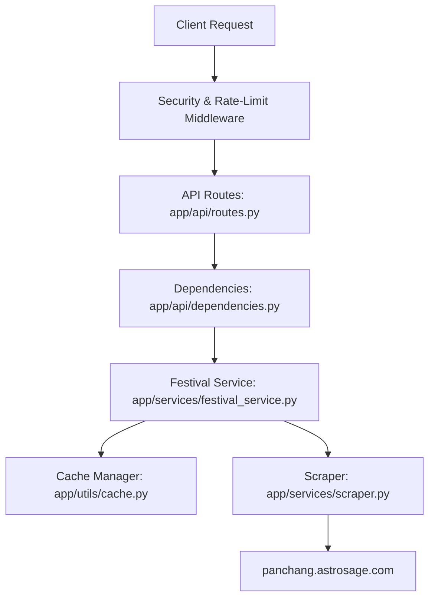
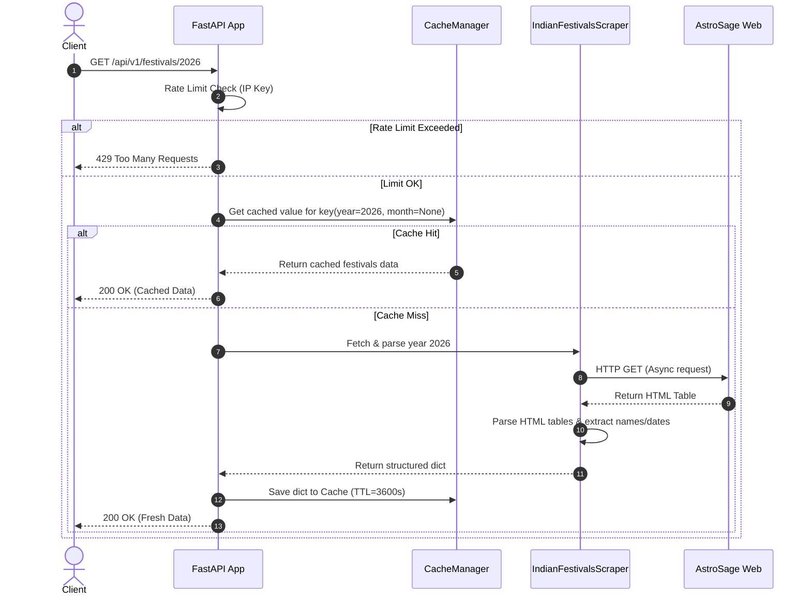

# Project Analysis & Code Review: Indian Festivals API

A comprehensive technical evaluation of the Indian Festivals API codebase, outlining the system architecture, component breakdown, data flow, and key bugs resolved in version 1.0.1.

---

## 1. Executive Summary

The **Indian Festivals API** is a high-performance, asynchronous REST API built using **FastAPI** (Python >= 3.14). It dynamically scrapes, caches, and normalizes Indian festival data, national holidays, and regional celebrations from AstroSage Panchang. 

### Core Statistics
- **Framework:** FastAPI
- **Version:** `1.0.1`
- **Package Infrastructure:** `uv`
- **Caching Layer:** Bounded, thread-safe memory ring-buffer cache (`cachetools.TTLCache`)
- **API Documentation:** OpenAPI interactive documentation (`/docs`, `/redoc`) enabled with secure Content-Security-Policy rules.

---

## 2. Project Architecture & Component Breakdown



### Module Responsibilities

| Directory/File | Component | Purpose |
| :--- | :--- | :--- |
| [`app/main.py`](file:///e:/codeLabPraveen/own/program/python/prj/apis/indian-festivals-api/app/main.py) | Application Entrypoint | Initializes FastAPI, registers routes, configures structured logging, and registers global middlewares (CORS, GZip, rate-limiting, and security headers). |
| [`app/config.py`](file:///e:/codeLabPraveen/own/program/python/prj/apis/indian-festivals-api/app/config.py) | Configuration Management | Manages environment configurations securely via `pydantic-settings`. |
| [`app/api/`](file:///e:/codeLabPraveen/own/program/python/prj/apis/indian-festivals-api/app/api/) | Routing & Dependency Layer | Defines endpoints and handles query/path validation. Uses FastAPI dependencies for singleton service and cache injections. |
| [`app/models/schemas.py`](file:///e:/codeLabPraveen/own/program/python/prj/apis/indian-festivals-api/app/models/schemas.py) | Data Schemas | Defines validation models for API payloads. Models use `frozen=True` to improve serialization speed. |
| [`app/services/`](file:///e:/codeLabPraveen/own/program/python/prj/apis/indian-festivals-api/app/services/) | Business & Scraping Logic | Contains `FestivalService` (mediates caching) and `IndianFestivalsScraper` (handles asynchronous page parsing). |
| [`app/utils/cache.py`](file:///e:/codeLabPraveen/own/program/python/prj/apis/indian-festivals-api/app/utils/cache.py) | Cache Layer | Bounded memory cache with custom item-level expiration controls and deterministic key generation. |
| [`app/middleware/`](file:///e:/codeLabPraveen/own/program/python/prj/apis/indian-festivals-api/app/middleware/) | Middlewares | Implements custom rate-limiting (slowapi proxy-aware keys) and global exception mapping. |

---

## 3. Data Flow Walkthrough



---

## 4. Key Bugs Resolved in Version 1.0.1

Three critical bugs were identified and successfully resolved to bring the application to production-ready status:

### 1. Rate-Limit Granularity Format Crash
* **The Bug**: The API routes and middleware used `f"{settings.RATE_LIMIT_REQUESTS}/{settings.RATE_LIMIT_WINDOW}s"` (e.g. `"100/60s"`). The `limits` parsing engine rejected `s` and raised `ValueError: no granularity matched for s`, crashing all incoming requests.
* **The Fix**: Changed `"s"` to `" seconds"`. The rate-limit constraints now parse correctly, resolving pipeline crashes.

### 2. Caching Custom TTL Value Leak
* **The Bug**: Custom TTL values were stored in the cache wrapped in a 2-tuple `(value, expiry)`. Upon cache hits, if the key-generation query arguments lacked the `_meta` field, the extraction logic bypassed tuple unwrapping and returned the raw `(value, expiry)` tuple directly to the service layer. This caused `'tuple' object has no attribute 'items'` crashes.
* **The Fix**: Replaced key-dependent checking with a 3-tuple structure `(value, expiry, "custom_expiry")`. Retrieval checks now inspect the cached item type directly, extracting payload contents cleanly regardless of query arguments.

### 3. Documentation Rendering & CSP Blocks
* **The Bug**: Interactive Swagger UI and ReDoc pages were blank. First, the endpoints were disabled unconditionally when `DEBUG=False`. Second, the security middleware injected `Content-Security-Policy: default-src 'self'`, causing browsers to block scripts and styles loaded from external CDNs (like `cdn.jsdelivr.net`).
* **The Fix**: Enabled `/docs` and `/redoc` unconditionally. Restructured `add_security_headers` middleware in [`app/main.py`](file:///e:/codeLabPraveen/own/program/python/prj/apis/indian-festivals-api/app/main.py) to check the request path and selectively relax CSP headers for documentation endpoints to permit CDN loading, keeping security strict on the core API endpoints.

---

## 5. Security & Operational Verification

The test suite passes cleanly:
```bash
uv run --with pytest --with pytest-asyncio --with httpx pytest tests/ -v
```
**Result**: `12 passed` in 8.53 seconds.
